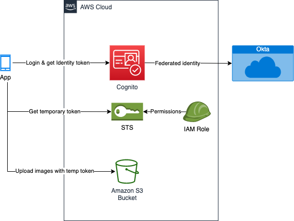

# Cognito with federated identity

Below is an illustration of a Amazon Cognito based solution to securely store user's image assets from a mobile app. The solution uses the federated identity that externalizes the user pool and lets the user to login through a system where they already have an account. In this case, we used an enterprise OIDC solution built on OKTA to let the user to login and provide the necessary authorization to the mobile app.

The mobile app then gets temporary AWS credentials from the identity pool which has the necessary IAM role that lets the app to read and write to specific folders (only to the user's folder identified by the "sub" from the ID token)

 

