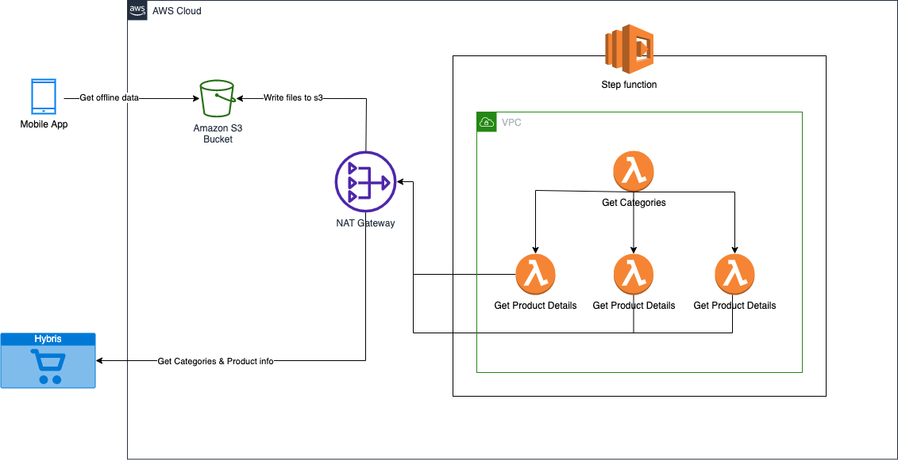

# Offline catalog download
The following is a high level architecture of an AWS based solution that collects the E-Commerce catalog, creates  JSON files (one per category) and places them in an S3 bucket.
API Gateway is then used to proxy the S3 bucket contents as RESTful APIs for the clients.
The clients (mostly mobile devices) can get the JSON files and store them in cache to be used for offline catalog browsing.
This was the solution designed and implemented by me to let the users in poor bandwidth to browse the e-commerce catalog by downloading them when in a good bandwidth connection.

