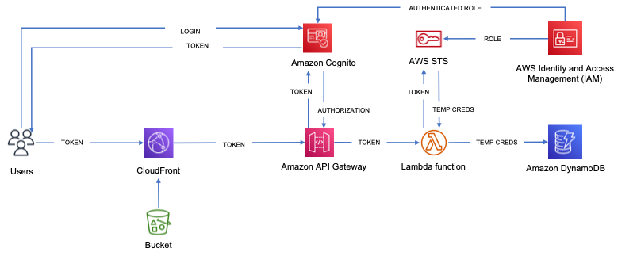

# Serverless app architecture

This is a  design for a serverless application with CloudFront, S3, Amazon Cognito, Lambda, and DynamoDB

The application uses Cognito user pool as the identity provider. The IAM role assigned for the authenticated user in the identity pool settings has finegrained rules that allow reading and writing to only those items in DynamoDB table that the user has access to.

The architecture and the details of implementation can be read in the 3 part series of articles I have written in LinkedIn.

<b>See links below</b>

<a target="_blank" href="https://www.linkedin.com/pulse/building-serverless-app-part-1-anwar-sadat/">Building a serverless app - part 1</a>

<a target="_blank" href="https://www.linkedin.com/pulse/building-serverless-app-part-2-anwar-sadat/">Building a serverless app - part 2</a>

<a target="_blank" href="https://www.linkedin.com/pulse/building-serverless-app-part-3-anwar-sadat/">Building a serverless app - part 3</a>

 

