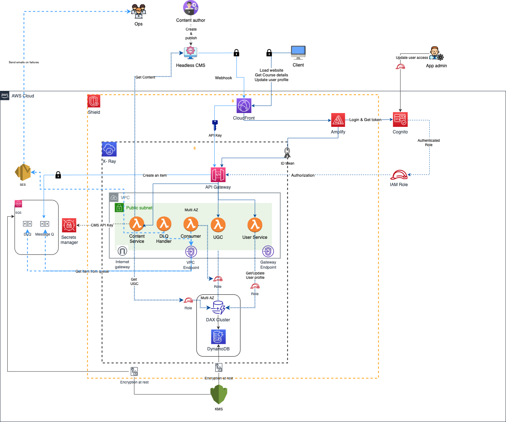

# Training website design

The following is a high level architecture of an AWS based solution for a training website

A headless CMS is used for creating content.

The CMS' webhook is used to create / update entires in a DynaboDB table whenever a content entry is created, edited or deleted.

The website is hosted in a S3 bucket and uses AJAX to load and search content.

An IAM role based fine grained access is used to read items from the DynamoDB table. The role is assigned by Cognito Identity pool.

Cognito user pool is used as IdP and identity pool is used to assign roles to the authenticated user (through temporary credentials) to list the items from the table.

Out of the box search API of the headless CMS is used to fetch the search results which are then filtered using the items that are accessible to the user.

